# How to use the UltimateSpawner?

## Summary
1. [Basic Settings](#basic-settings)
2. [Spawn Settings](#spawn-settings)
   * Fixed Time
   * Progressive Time
   * Random Time
   * External
   * Input
3. [Position Settings](#position-settings)
   * Spawner
   * Spawn Point
   * Position
   * Target Transform
4. [Rotation Settings](#rotation-settings)
   * Identity
   * Spawner
   * Custom
   * Object Own Rotation
5. [Movement Settings](#movement-settings)
6. [Pool Settings](#pool-settings)

## Basic Settings

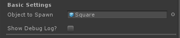

In basic settings you have only two fields:
- **Object to Spawn** - Here you select the prefab to be spawned
- **Show Debug Log** - Toogle on/off debug.log messages

## Spawn Settings

All the magic begins here! To start spawning objects in your game, you have to configure a few things.

The first of them it's the **Spawn Mode**. I made simple spawn modes that I usually use in my games. And they are: Fixed Time, Progressive Time, Random Time, External, Input. Let's begin with...

### Fixed Time

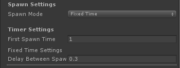

The Fixed Time mode will spawn the object in (belive me) a fixed amount of time. Remember to put te time in seconds, okay?

When you choose this mode a new setting section shows up. It's the **Timer Settings** and here you can configure the time-based spawn modes.

There are two new fields now:
- **First Spawn Time** - Time in seconds until the spawner begins to spawn
- **Seconds Between Spaws** - Time in seconds until next spawn

I think it's really simple to understand, for example, you can set your first spawn to happen in 10 seconds and after that you can set it to spawn every 1 second.

### Progressive Time

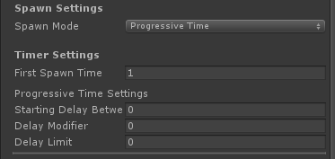

So, you think a fixed time won't be very useful to a game that gets harder through time, huh? No problem. Pregressive time is here to make things easier. (at least for you. Sorry players!)

~~I have to admit that I'm not happy with how this works, as soon as I can I will improve it's behaviour to make it's a cooler progressive time setup~~

Since we are working with a spawn mode based in time, you still have the **Timer Settings**, but the fields changed a little:

- **First Spawn Time** - I already told you about this one, but I can say it again: Time in seconds until the spawner begins to spawn 
- **Starting Delay Between Spawns** - It's the time in seconds to repeat spawn 
- **Delay Modifier** - Time in seconds to reduce from the current delay time
- **Delay Limit** - Time in seconds to use as minimum delay

Let me explain a bit more. Let's make a impossible Flappy Bird. We can set the first pipe to spawn after 1 second, and then repeat every 1 second. And to make it a bit more interesting we can setup to reduce this repeat behaviour to decrease by .1f (10% of a sec) every spawn. But things can go really wrong, so it's better we setup a limit maybe .5f (half a second), because we don't really wan't it impossible, just really hard. >:D

### Random Time

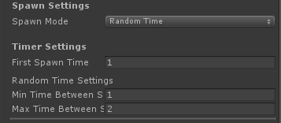

Last one of the timer settings, Random Time mode spawns in a random range. That simple! It brings just two new more fields:

- **Minimum Time Between Spawns** - Time in seconds to use as a minimum value to the time range
- **Maximum Time Between Spawns** - Time in seconds to use as a maximum value to the time range

You have a Super Hyper Mega Ultra Rare Item and want it to spawn somewhere between 30 seconds and a minute? No problem. This option is for you!

### External

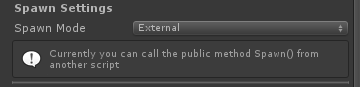

The external it's not fully implemented, but it'll leaves you an open door to call the spawn function outside the spawn script. It can be from another script or a button or a trigger. You choose. Just call the Spawn() method.

### Input

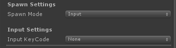

For now it uses unity Keycode options(just for now). 

## Position Settings

Here you can setup the object's spawn position.

### Spawner Position

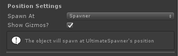

The first option is to spawn it at UltimateSpawner current position

### Spawn Point

I created spawn points as ScriptableObjects to make them simple to edit outside UltimateSpawner main script and to make them as reusable as possible.

**How to create a SpawnPoint**:

Inside the desired folder just click with the right button and "Create/UltimateSpawner/SpawnPoint". It will create a new file .asset and you just have to put a name in it.

**How to setup a SpawnPoint**:
After created your spawnpoint you can setup it's type:

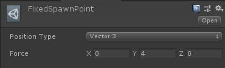
- **Position Type**: You setup it's X,Y,Z position

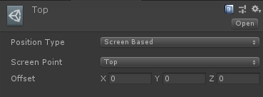
- **Screen Based**: You setup it's position based in a screen point (like in canvas)
    * **Screen Point**: This is the pivot point
    * **Offset**: You can setup a offset based on it's pivot point

#### Fixed

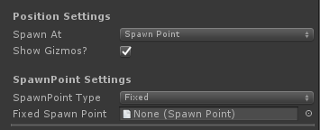

Choose a fixed spawn point and UltimateSpawner will always spawn at this same spawn point.

#### Random Fixed

Choose a few spawn points to make UltimateSpawner randomize between them.

### Position

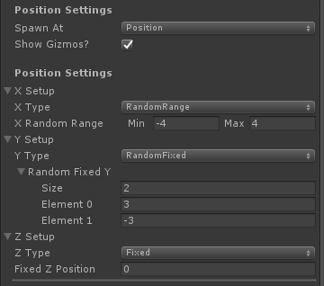

The Position Option let you setup each axis independently. There are a few options that can be applied to each of them:

- **Fixed**: It'll remain the same position always
- **Random Fixed**: You can setup a list of positions to make UltimateSpawner randomize between them
- **Random Range**: Set a minimum and maximum value to make UltimateSpawner Randomize between a this range.

### Target Transform

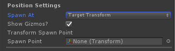

Choose a transform already in scene.

## Rotation Settings

### Identity

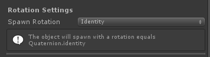

Makes the spawned object's rotation (0,0,0).

### Spawner Rotation

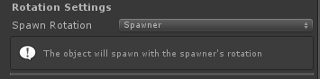

The spawned object will use the UltimateSpawner's rotation.

### Custom

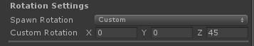

You can setup a custom (X,Y,Z). (It's simple for now, but will be improved soon!)

### Object Own Rotation

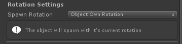

The prefab already have it's rotation setted up? No problem! Just use it's own rotation.

## Movement Settings

The Movement Behaviour is still under testing, I made it as a first attempt to expand UltimateSpawner to use plugins. It's not as I expected, but it's working ~~kinda~~. Also have plans to improve it soon.

If you want to test it, no problem. It works like this:

You configure it as you want, and UltimateSpawner will add a plugin script to the object during spawn. This plugin script checks for a rigidbody or a rigidbody2D. Don't forget to add it to your object

### None

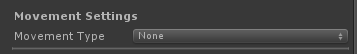

As it says, you don't apply any movement in the spawned object.

### Force

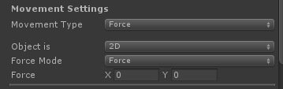

You apply a movement based in ForceMode and ForceMode2D.

### Velocity

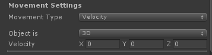

You apply a velocity to the spawned object.

## Pool Settings

**What is Object Pooling?**
> The object pool pattern is a software creational design pattern that uses a set of initialized objects kept ready to use – a "pool" – rather than allocating and destroying them on demand. A client of the pool will request an object from the pool and perform operations on the returned object. When the client has finished, it returns the object to the pool rather than destroying it; this can be done manually or automatically.
> — Wikipedia

Now that we know what is object pooling, here is a simple object pooling based on Unity's object pooling tutorial.

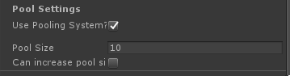

If you toggle the Pool System on it will bring you a new field and a new toggle switch.

- **Pool Size** - Here you can setup the pool size. It means, the quantity of instantiated objects you will use in game.
- **Can Increase Pool Size?** - If your pool is not big enough, no problem. Toggle this on and it'll increase the pool size if necessary

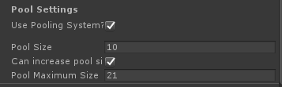

When you select to increase the pool size it brings you a new field:

- **Pool Maximum Size** - The UltimateSpawner will increase the pool size until it reaches the max size.
