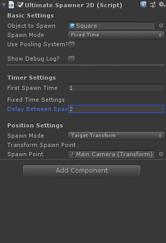

# UltimateSpawner
UltimateSpawner is a simple spawn system created for Unity projects.

## Features
- Different spawn modes (FixedTime, Progressive, RandomTime, External, Input)
- Built-in pooling system (With easy activation)
- Choose spawn point (Spawner Position, Fixed Position, Random Position, Target Transform)
- Built-in timer
- Activate/Deactivate Debug Logs

## How to use it

1. [Download the latest release](https://github.com/reneabreu/UltimateSpawner2D/releases)
2. Import the package inside your Unity Project
3. Play with the sample scene (:

### Creating a Spawn Point
1. Choose the folder you want to create it
2. Right click inside it
3. Then Create > UltimateSpawner > Position to Spawn
    

## Why UltimateSpawner?
It's not like it is the best spawn system, but I was tired of creating a new spawn system for every new project I've started. So I created a spawn system with everything I need. With this in mind I hope I don't need to create another spawn system again.
