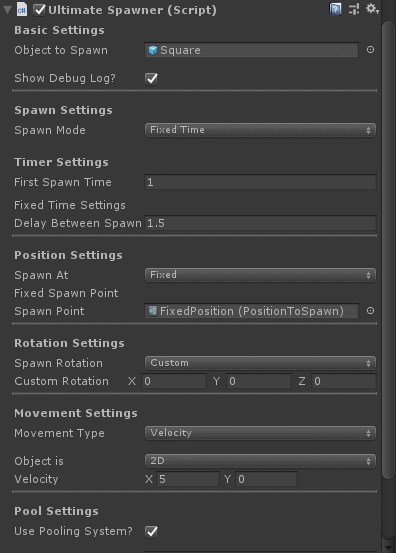
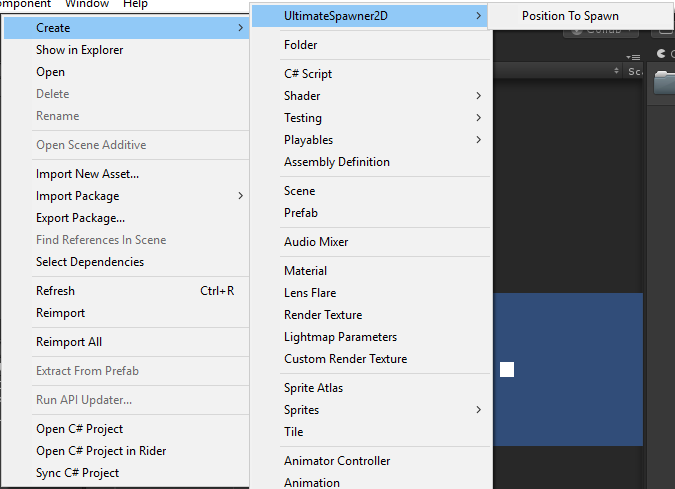

# UltimateSpawner

    
    

UltimateSpawner is a simple spawn system created for Unity projects.

## Features
- Choose SpawnMode
    - FixedTime 
    - Progressive
    - RandomTime
    - External
    - Input
- Choose SpawnPoint 
    - Spawner Position
    - Fixed Position
    - Random SpawnPoints
    - Target Transform
- Change spawned object's rotation
    - Quaternion.identity
    - Spawner Rotation
    - Custom Rotation
    - Object Current Rotation
- Move the spawned object
    - 2D/3D
    - Rigidbody Velocity
    - Rigidbody AddForce
- Built-in pooling system (With easy activation)
- Built-in timer
- Activate/Deactivate Debug Logs

## How to use it

1. [Download the latest release](https://github.com/reneabreu/UltimateSpawner2D/releases)
2. Import the package inside your Unity Project
3. Play with the sample scenes (:

### Creating a Spawn Point
1. Choose the folder you want to create it
2. Right click inside it
3. Then Create > UltimateSpawner > Position to Spawn
    

## Why UltimateSpawner?
It's not like it is the best spawn system, but I was tired of creating a new spawn system for every new project I've started. So I created a spawn system with everything I need. With this in mind I hope I don't need to create another spawn system again.
